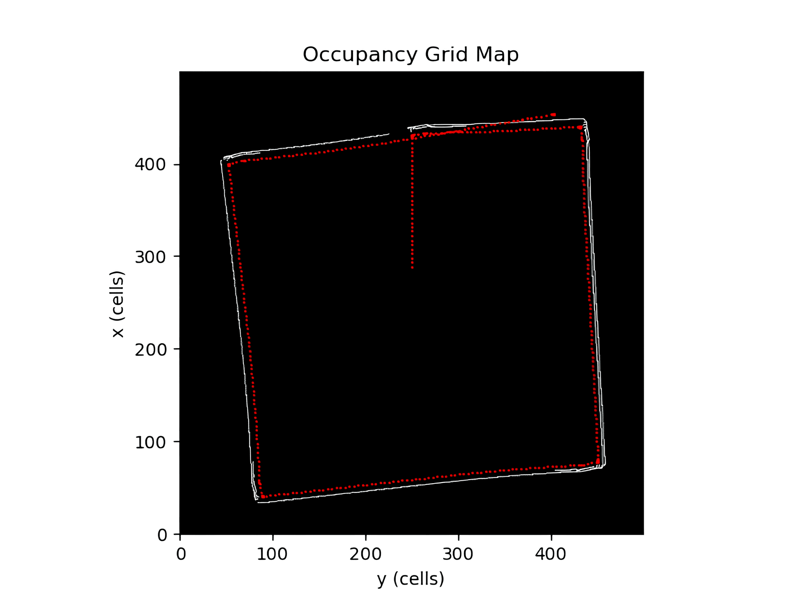

# iRobot-ROS2-Demos
Scripts en Python para controlar el iRobot Create3 con ROS2 Humble. Incluye ejemplos básicos de movimiento, lectura de sensores y comportamientos autónomos simples. Son útiles para gente que está aprendiendo los conceptos básicos de ROS2.


## Scripts principales

- **actual_position.py**  
  Muestra la posición y orientación del robot en consola.

- **battery_try.py**  
  Imprime el porcentaje de batería del robot.

- **combine_sub_actions.py**  
  Detecta colisiones (bumpers) y ejecuta giros automáticos.

- **dock_python.py**  
  Automatiza el acoplamiento del robot a la base de carga.

- **undock_python.py**  
  Ejecuta la acción de desacoplar el robot de la base y resetea la pose.

- **rotate_test.py**  
  Ejecuta una rotación del robot mediante acción.

- **ir_sensors_python.py**  
  Lee y muestra los valores de los sensores infrarrojos.

- **key_control_secure.py**  
  Permite controlar el robot con el teclado, deteniéndose ante obstáculos.

## Mapeo y navegación

- **map/obstacle_map.py**  
  Mueve el robot esquivando obstáculos y publica un mapa de ocupación.

- **map/waypoint_node_map.py**  
  Navega hacia un waypoint esquivando obstáculos y publica el mapa.

- **map/waypoint_node_map2.py**  
  Navegación tipo "Bug" para rodear obstáculos y registrar puntos de impacto.

- **map/map.py**  
  Visualiza el mapa de ocupación y la trayectoria del robot en tiempo real.


**Simulación en Gazebo:**


**Mapa de ocupación generado:**




## Requisitos

- ROS2 Humble
- Paquete `irobot_create_msgs`
- Python 3.x
- numpy, matplotlib, pynput

## Uso

Ejecuta cada script directamente con Python si tienes el entorno configurado:

```sh
python3 <script>.py
```

Consulta cada archivo para detalles de uso y parámetros.
